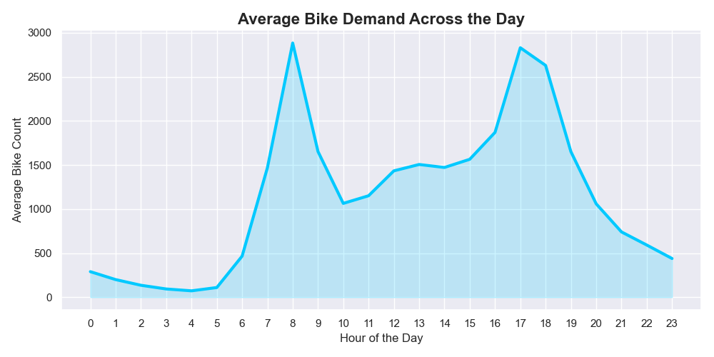
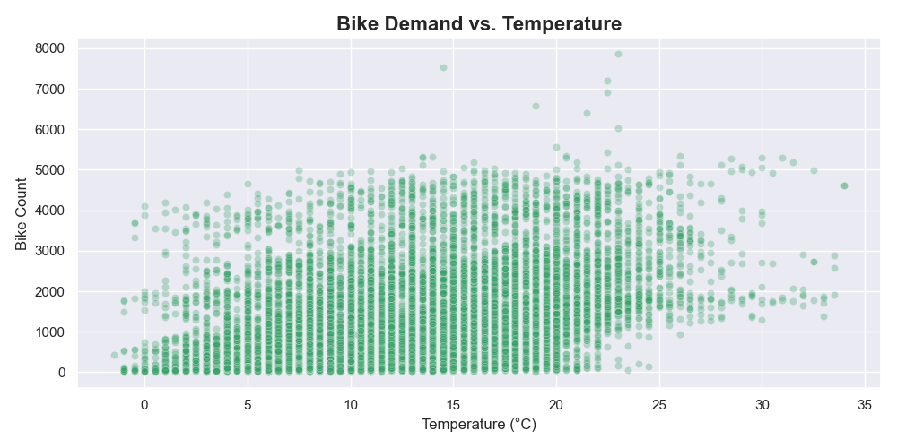

# 🚴‍♂️ London Bike-Sharing Demand Prediction using Machine Learning

[](https://www.python.org/)
[](https://londonbikesharingproject.streamlit.app/)
[](https://scikit-learn.org/)

This repository contains an End-to-End machine learning project focused on predicting demand for London's Santander bike-sharing system using real-world environmental and temporal data. It features a modular MLOps pipeline, centralized YAML configuration, and an interactive **Streamlit Dashboard** for real-time predictions.

🚀 **Live Demo:** [https://londonbikesharingproject.streamlit.app/](https://londonbikesharingproject.streamlit.app/)

---

## 📌 Project Overview & Goal

Bike-sharing systems offer a sustainable and efficient transportation alternative in modern cities. However, operators still face challenges in predicting demand and allocating bikes efficiently. 

**Project Goals:**
- Analyze factors affecting hourly demand for bike rentals in London
- Build predictive regression models to forecast bike usage
- Identify the most influential features affecting demand
- Deploy the most effective model into an interactive Web Application
- Derive actionable insights for improving bike-sharing operations

---

## 📊 Dataset

**Source**: [Kaggle - London Bike Sharing Dataset](https://www.kaggle.com/datasets/hmavrodiev/london-bike-sharing-dataset)

- **Records**: 17,414 hourly entries
- **Features**: Timestamp, Temperature, Humidity, Wind Speed, Weather Code, Holiday/Weekend Flags, Season, etc.
- **Target**: `cnt` – total bike rentals per hour

---

## 📈 Exploratory Data Analysis (EDA) & Insights

During data preprocessing, we extracted temporal features (hour, day, month, year) and verified that there were no missing values. We retained outliers after validation as they represented genuine demand spikes (e.g., during summer).

### Average Bike Demand Across the Day
Bike rentals peak heavily during the morning commute (8 AM) and evening commute (5-6 PM).


### Bike Demand vs. Temperature
Demand consistently increases as temperatures rise, peaking during warm, clear summer days before tapering off slightly in extreme heat.


---

## 🤖 Machine Learning Models Comparison

During the initial experimental phase, several regression models were trained and evaluated:

| Model              | R² Score | RMSE    | MAE    |
|-------------------|----------|---------|--------|
| Linear Regression  | 0.727    | 571.70  | 394.16 |
| Lasso Regression   | 0.727    | 571.59  | 393.81 |
| Random Forest      | 0.940    | 267.99  | 149.63 |
| Gradient Boosting  | 0.944    | 258.44  | 160.78 |
| AdaBoost           | 0.455    | 808.20  | 693.98 |

📌 **Best Model**: Gradient Boosting  
💡 **Recommended Model for Deployment**: Random Forest (robust, scalable, interpretable)

*(Note: The deployed Random Forest model in this pipeline achieved an even better R² Score of **0.957** after final pipeline optimizations).*

---

## 🏗️ Project Architecture & Deployment

This project was transformed from an experimental Jupyter Notebook into a professional, scalable ML repository.

- **Modular Design:** Data ingestion, transformation, and model training are separated into reusable components.
- **Zero-Config Cloud Deployment:** The Streamlit app features an intelligent `load_assets()` function. If the 125MB model file is missing (to avoid GitHub's file size limits), the app automatically triggers the ML training pipeline in the cloud, generating the model on-the-fly in ~10 seconds. This allows for 1-click deployments to platforms like Streamlit Cloud!

```
├── Bicycle_sharing.ipynb       # Original Notebook with extensive EDA and model comparisons
├── app.py                      # Premium Streamlit Dashboard UI (with auto-training logic)
├── train.py                    # Master orchestrator for the ML pipeline
├── config/
│   └── config.yaml             # Centralized hyperparameters and file paths
├── src/
│   ├── components/
│   │   ├── data_ingestion.py     # Reads and splits data
│   │   ├── data_transformation.py# Feature engineering & encoding
│   │   └── model_trainer.py      # Random Forest model training & evaluation
│   ├── exception.py            # Custom automated traceback handling
│   └── logger.py               # Centralized logging configuration
├── models/                     # Saved pkl artifacts (Ignored in Git)
└── dataset/                    # Raw and processed CSV data
```

---

## 🔍 Key Findings

- **Temperature** is the most influential factor for demand, with demand peaking during warm but not extreme temperatures.
- **Clear and dry weather** leads to higher bike usage; rainy or stormy conditions suppress it.
- **Time-based features** (hour, month, season) significantly impact usage trends.
- **Random Forest and Gradient Boosting** yielded the best predictive performance, massively outperforming linear models by capturing non-linear interactions without strict feature scaling.
- Outliers in bike demand were valid (e.g., spikes in summer), so they were retained.

---

## 🧠 Conclusion

This project demonstrates that machine learning techniques can effectively predict bike-sharing demand using environmental and temporal data. 
Insights from this project can support operational decisions such as:
- Predictive allocation of bikes
- Infrastructure planning (e.g., high-demand zones)
- Resource optimization during peak demand periods

---

## 🧩 Future Recommendations

- Collect real-time station-level data to develop spatial rebalancing models.
- Implement a simple classification system (e.g., low, medium, high demand signals).
- Extend the model with post-pandemic behavior data and public transport disruptions.

---

## 💻 Running the App Locally & Cloud Deployment

1. **Clone the repository:**
```bash
git clone https://github.com/yourusername/London_Bike_Sharing_Project.git
cd London_Bike_Sharing_Project
```

2. **Install Dependencies:**
```bash
pip install -r requirements.txt
```

3. **Launch the Dashboard (Auto-Training Enabled!):**
You don't need to manually train the model! Just run the app. If the heavy model file is missing, the app will automatically train a fresh model for you on the fly in ~10 seconds before launching the UI.
```bash
streamlit run app.py
```

---

## 👨‍💻 Author

**Himel Das**  
*Aspiring Data Scientist | Passionate about ML, analytics, and solving real-world problems*  
🔗 [LinkedIn Profile](https://www.linkedin.com/in/dashimel/)

---

## 📄 License

This project is for educational and portfolio purposes only. Not intended for commercial use.
